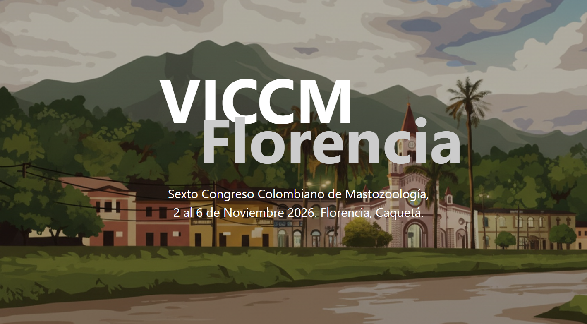

# VICCM 

[https://www.mamiferoscolombia.org/VICCM/](https://www.mamiferoscolombia.org/VICCM/)

This is the GitHub repository for the VICCM website. 

  *  **Noticias**: 
  *  **Cursos**: 
  *  **Sede**: 
  *  **Simposios**: 

Cloned and Build on top of the amazing website of [ALA Labs](https://labs.ala.org.au/)