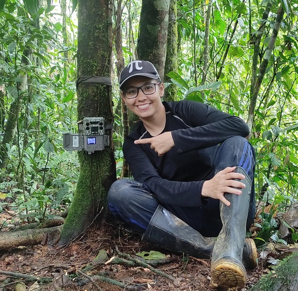

```{r, include=FALSE}
library(htmltools)
library(here)
source(here("R", "functions.R"))
```

###  Bio 

:::{.bio-row}
:::{.bio-column-right}

```{r out.width='275px', out.extra='style="display:block; margin-left:auto; margin-right:auto; clip-path: circle();"'}
#| echo: false

```
:::

:::{.bio-column-left}
Contador y especialista en Gerencia de Empresas Agropecuarias, Universidad de la Amazonia. Tiene experiencia en el manejo financiero de proyectos del Sistema General de Regalías y fue Coordinador del proyecto Fortalecimiento de Vocaciones Científica en la Región Centro-Sur. Caquetá, Putumayo, Huila, Tolima.

En el VICCM Carlos está encargado del área contable.
:::
:::

:::{.column-body style="margin-top:-20px;"}
```{r}
#| echo: false

tags$div(class = "row", style = "display: flex;",
         
create_button(
  icon = "fab fa-facebook fa-xl",
  url = "https://www.facebook.com/luisa.martineztkd/photos"
),
# create_button(
#   icon = "fab fa-linkedin fa-xl",
#   url = "https://www.linkedin.com/in/hugo-mantilla-meluk-46b405223/?originalSubdomain=co"
# ),
create_button(
  icon = "fab fa-instagram fa-xl",
  url = "https://www.instagram.com/Luisamartineztkd"
)
)
```
:::


###  Posts 

