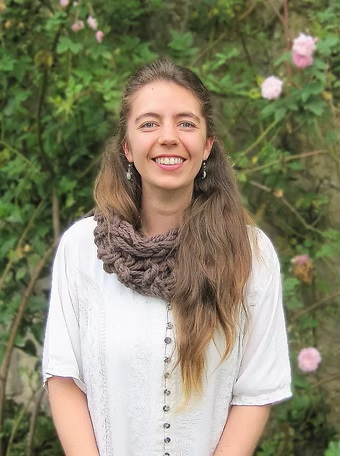

```{r, include=FALSE}
library(htmltools)
library(here)
source(here("R", "functions.R"))
```

###  Bio 

:::{.bio-row}
:::{.bio-column-right}

```{r out.width='275px', out.extra='style="display:block; margin-left:auto; margin-right:auto; clip-path: circle();"'}
#| echo: false

```
:::

:::{.bio-column-left}
Catalina es ecóloga de la Pontificia Universidad Javeriana (Bogotá), CEO de Arasarí Conservación e Investigación S.A.S. y presidenta de la Sociedad Colombiana de Mastozoología. Cuenta con experiencia en investigación mastozoológica, con énfasis en guaguas, puercoespines y tigrillos. Posee una sólida trayectoria en la organización y coordinación de eventos científicos de alcance nacional, participando en comités organizadores, académicos y logísticos de diversas ediciones del Congreso Colombiano de Mastozoología y del Congreso Colombiano de Ecología. Su trabajo integra gestión académica, articulación institucional y divulgación científica en ecología y mastozoología en Colombia.

En el VICCM Catalina dirije el comité organizador.
:::
:::

:::{.column-body style="margin-top:-20px;"}
```{r}
#| echo: false

tags$div(class = "row", style = "display: flex;",
         

create_button(
  icon = "fas fa-globe fa-xl",
  url = "https://www.arasari-ci.com/"
),
create_button(
  icon = "fab fa-researchgate fa-xl",
  url = "https://www.researchgate.net/profile/Dora-Concha-Osbahr-2"
),
create_button(
  icon = "fab fa-linkedin fa-xl",
  url = "https://www.linkedin.com/in/dora-catalina-concha-osbahr-42031297/?trk=prof-samename-name&originalSubdomain=co"
)
)
```
:::


###  Posts 

[Invitación](https://www.mamiferoscolombia.org/VICCM/noticias/2026-02-01_invitacion/)<br>
*El Comité Organizador del VICCM invita a presentar propuestas para la realización de simposios, talleres, mesas redondas, cursos y otras actividades académicas del VICCM.*