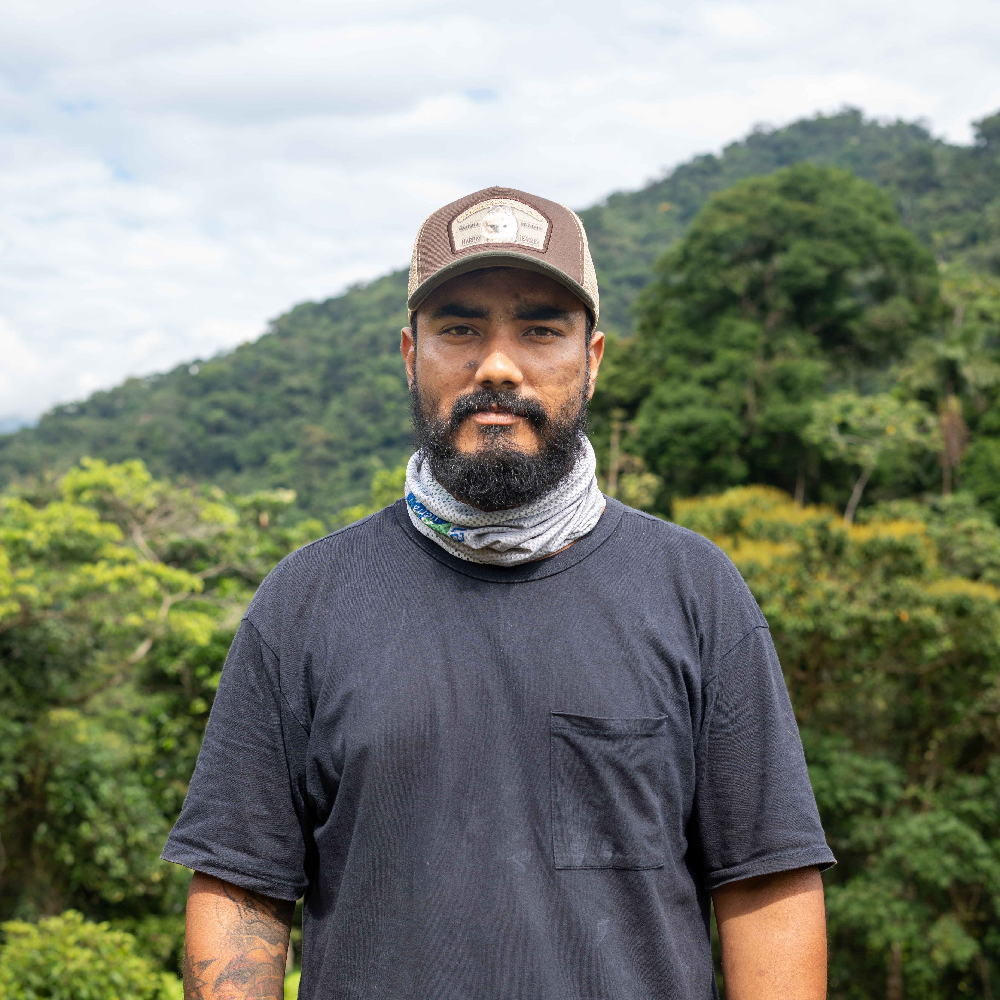

```{r, include=FALSE}
library(htmltools)
library(here)
source(here("R", "functions.R"))
```

###  Bio 

:::{.bio-row}
:::{.bio-column-right}

```{r out.width='275px', out.extra='style="display:block; margin-left:auto; margin-right:auto; clip-path: circle();"'}
#| echo: false

```
:::

:::{.bio-column-left}
Estudiante de Biología de la Universidad de la Amazonia. Integrante del Semillero de Investigación en Biodiversidad Amazónica y Agroecosistemas (SIBIAMA) de la Universidad de la Amazonia. Cuenta con experiencia en el desarrollo de piezas audiovisuales, cortometrajes, reels, teaser y demás elementos para la difusión de información a través de páginas web y redes sociales (ver).

En el VICCM Erick está encargado de los elementos de divulgación.
:::
:::

:::{.column-body style="margin-top:-20px;"}
```{r}
#| echo: false

tags$div(class = "row", style = "display: flex;",
         
create_button(
  icon = "fab fa-facebook fa-xl",
  url = "https://www.facebook.com/luisa.martineztkd/photos"
),
# create_button(
#   icon = "fab fa-linkedin fa-xl",
#   url = "https://www.linkedin.com/in/hugo-mantilla-meluk-46b405223/?originalSubdomain=co"
# ),
create_button(
  icon = "fab fa-instagram fa-xl",
  url = "https://www.instagram.com/Luisamartineztkd"
)
)
```
:::


###  Posts 

