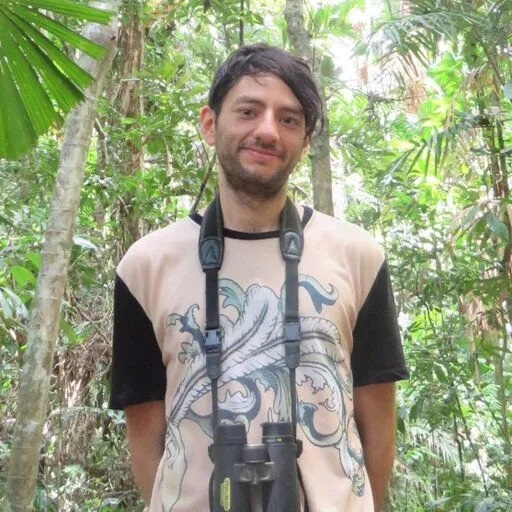

```{r, include=FALSE}
library(htmltools)
library(here)
source(here("R", "functions.R"))
```

###  Bio 

:::{.bio-row}
:::{.bio-column-right}

```{r out.width='275px', out.extra='style="display:block; margin-left:auto; margin-right:auto; clip-path: circle();"'}
#| echo: false

```
:::

:::{.bio-column-left}
El Dr. Andrés Felipe Suárez Castro combina diferentes herramientas para ampliar el conocimiento de la biodiversidad en áreas poco monitoreadas, comprender los factores que determinan la distribución de las especies y predecir los efectos de las presiones antrópicas sobre la diversidad funcional y los servicios ecosistémicos. Su trabajo ha contribuido al conocimiento de los mamíferos en Colombia mediante la documentación de los primeros registros para cuatro especies para el país, la descripción de una especie nueva, el desarrollo de inventarios y revisiones taxonómicas con comentarios sobre la ecología de especies, y la consolidación de la lista de mamíferos de Colombia 

En el VICCM Andres Felipe apoya al comité científico.
:::
:::

:::{.column-body style="margin-top:-20px;"}
```{r}
#| echo: false

tags$div(class = "row", style = "display: flex;",
         
create_button(
  icon = "fab fa-researchgate fa-xl",
  url = "https://www.researchgate.net/profile/Andres-Suarez-Castro"
),
create_button(
  icon = "fab fa-twitter fa-xl",
  url = "https://x.com/fsuarezca"
),
create_button(
  icon = "fab fa-orcid fa-xl",
  url = "https://orcid.org/0000-0002-6621-3821"
)
)
```
:::


###  Posts 

