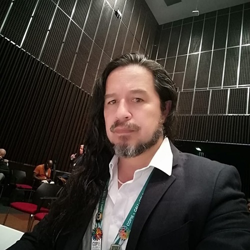

```{r, include=FALSE}
library(htmltools)
library(here)
source(here("R", "functions.R"))
```

###  Bio 

:::{.bio-row}
:::{.bio-column-right}

```{r out.width='275px', out.extra='style="display:block; margin-left:auto; margin-right:auto; clip-path: circle();"'}
#| echo: false

```
:::

:::{.bio-column-left}
Hugo es biólogo de la Universidad Nacional de Colombia y doctor en Sistemática y Evolución por la Universidad Tecnológica de Texas, donde se graduó con honores. Es profesor investigador de la Universidad del Quindío, curador de su Colección de Mamíferos y coordinador del Centro de Estudios de Alta Montaña. Es miembro de la Academia Colombiana de Ciencias Exactas, Físicas y Naturales y miembro fundador de la Sociedad Colombiana de Mastozoología. Su investigación se centra en la evolución de primates y murciélagos, y cuenta con amplia experiencia en la coordinación y dirección de simposios científicos nacionales e internacionales

En el VICCM Hugo está encargado del comité científico y los elementos de divulgación se han abordado desde lo técnico.
:::
:::

:::{.column-body style="margin-top:-20px;"}
```{r}
#| echo: false

tags$div(class = "row", style = "display: flex;",
         
create_button(
  icon = "fab fa-researchgate fa-xl",
  url = "https://www.researchgate.net/profile/Hugo-Mantilla-Meluk-2"
),
create_button(
  icon = "fab fa-linkedin fa-xl",
  url = "https://www.linkedin.com/in/hugo-mantilla-meluk-46b405223/?originalSubdomain=co"
),
create_button(
  icon = "fab fa-orcid fa-xl",
  url = "https://orcid.org/0000-0001-8134-3694"
)
)
```
:::


###  Posts 

