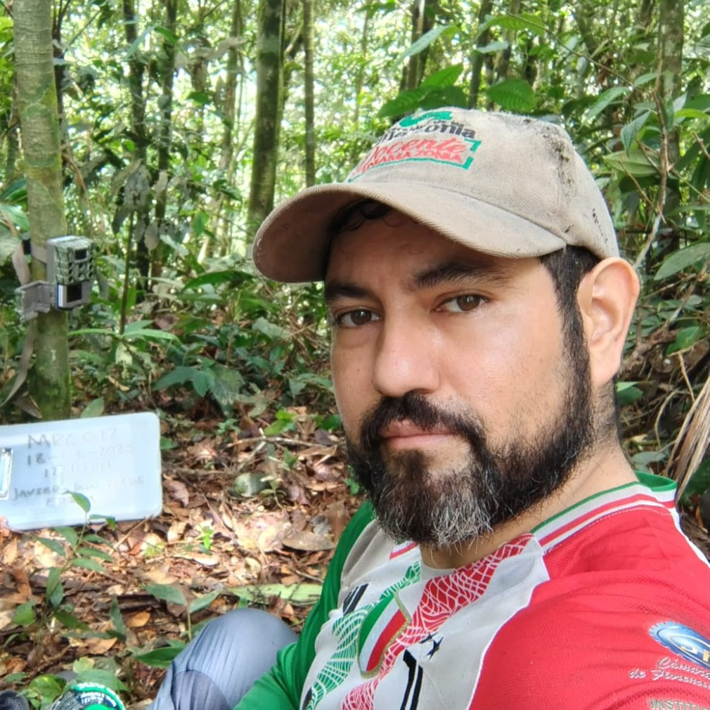

```{r, include=FALSE}
library(htmltools)
library(here)
source(here("R", "functions.R"))
```

###  Bio 

:::{.bio-row}
:::{.bio-column-right}

```{r out.width='275px', out.extra='style="display:block; margin-left:auto; margin-right:auto; clip-path: circle();"'}
#| echo: false

```
:::

:::{.bio-column-left}
Javier es biólogo de la Universidad Nacional de Colombia, su experiencia se ha concentrado en la Amazonía colombiana, particularmente en proyectos de educación ambiental, zoología, ecología y biología de la conservación. Ha desarrollado inventarios de mastofauna y cuenta con un sólido conocimiento taxonómico de la fauna silvestre amazónica, con énfasis en la conservación de primates y el estudio de mamíferos medianos y grandes. Es especialista en Gerencia del Talento Humano de la Universidad de la Amazonia y miembro fundador de la Asociación Colombiana de Zoología, la Sociedad Colombiana de Mastozoología y la Asociación Primatológica Colombiana, de la cual fue vicepresidente. Ha participado en la organización de eventos académicos, entre ellos el I Simposio Nacional de Jóvenes Investigadores de la Región Centro-Sur (Florencia, Caquetá, 2023).

En el VICCM Javier está encargado de la organizacion general del congreso.
:::
:::

:::{.column-body style="margin-top:-20px;"}
```{r}
#| echo: false

tags$div(class = "row", style = "display: flex;",
         
create_button(
  icon = "fab fa-google fa-xl",
  url = "https://scholar.google.com/citations?user=0d6gVY0AAAAJ&hl=es"
)
)
```
:::


###  Posts 

[Enviar Propuesta Simposio](https://www.mamiferoscolombia.org/VICCM/noticias/2026-02-09_Formulario/)<br>
*Diligencie el formulario para enviar propuestas de simposios, talleres, mesas redondas, cursos y otras actividades académicas del VICCM.*


[Video de Charlas Mastozoológicas](https://www.mamiferoscolombia.org/VICCM/noticias/2026-03-30_video)<br>
*Javier nos cuenta sobre el contexto Amazónico del congreso, nos habla de la sede y los eventos que podremos esperar.*