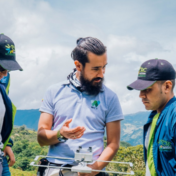

```{r, include=FALSE}
library(htmltools)
library(here)
source(here("R", "functions.R"))
```

###  Bio 

:::{.bio-row}
:::{.bio-column-right}

```{r out.width='275px', out.extra='style="display:block; margin-left:auto; margin-right:auto; clip-path: circle();"'}
#| echo: false

```
:::

:::{.bio-column-left}
Biólogo de la Pontificia Universidad Javeriana de Bogotá, Maestro en Ciencias biológicas de la misma universidad y doctor en Manejo y conservación de fauna silvestre en la Universidad de Arizona (Arizona-Estados Unidos de América). Mauricio ha estudiado las dinámicas de las poblaciones de mamíferos en matrices de paisaje heterogéneas con grupos bioindicadores. Además de lo anterior, su trabajo se ha centrado en el estudio de la ecología espacial de grandes carnívoros neotropicales y sus interacciones con comunidades humanas en diferentes regiones de Colombia y el neotrópico. Mauricio ha estado vinculado a la SCMas desde 2009, y participó como organizador del II Congreso Colombiano de Mastozoología y III Congreso Latinoamericano de Mastozoología realizados en el año 2018 en Bogotá. Mauricio ha sido parte del cuerpo editorial de la Revista Mammalogy Notes desde su creación.

En el VICCM Mauricio está encargado de los aspectos financieros.
:::
:::

:::{.column-body style="margin-top:-20px;"}
```{r}
#| echo: false

tags$div(class = "row", style = "display: flex;",
         
create_button(
  icon = "fab fa-facebook fa-xl",
  url = "https://www.facebook.com/luisa.martineztkd/photos"
),
# create_button(
#   icon = "fab fa-linkedin fa-xl",
#   url = "https://www.linkedin.com/in/hugo-mantilla-meluk-46b405223/?originalSubdomain=co"
# ),
create_button(
  icon = "fab fa-instagram fa-xl",
  url = "https://www.instagram.com/Luisamartineztkd"
)
)
```
:::


###  Posts 

