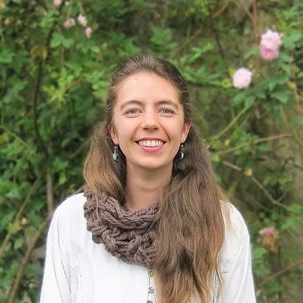

```{r}
#| cache: true
#| include: false
library(htmltools)
```

<!-- remove metadata section -->

```{=html}
<style>
  #title-block-header.quarto-title-block.default .quarto-title-meta {
      display: none;
  }
</style>
```

<!-- Author card -->

::::::: author-card
::: author-card-text
#### Author


[Catalina Concha-Osbahr](https://mamiferoscolombia.org/VICCM/about/Catalina_Concha/index.html)

#### Date

28 Enero 2026
:::

::::: {.row-b layout-ncol="3" style="margin-left: auto; margin-right: auto; margin-top: auto; margin-bottom: auto;"}
::: {.author-card-image style="width: auto; height: 120px; margin-right: auto !important;"}
</img>
:::

<!-- ::: {.author-card-image style="width: auto; height: 120px; margin-right: auto;"} -->
<!-- </img> -->
<!-- ::: -->
:::::
:::::::

<!------------------------ Post starts here ------------------------>

:::{.callout-tip}

## VICCM 2026 - Primera Circular 

:::
## Presentación

La Sociedad Colombiana de Mastozoología, junto a la Universidad de la Amazonia se complacen en anunciar la realización del VI Congreso Colombiano de Mastozoología - VICCM, que tendrá lugar en la ciudad de Florencia, Caquetá, Colombia, del 2 al 6 de noviembre de 2026.

El Congreso Colombiano de Mastozoología se celebra cada dos años y sus sedes se alternan de manera itinerante en distintas regiones biogeográficas de Colombia, con el propósito de visibilizar la riqueza natural y cultural de cada territorio, así como fortalecer el desarrollo de las distintas formas de construcción de conocimiento y de gestión de la biodiversidad de mamíferos a lo largo y ancho del territorio colombiano. Para esta sexta edición la sede será la Amazonía colombiana, una región reconocida mundialmente por su extraordinaria biodiversidad y por ser el hogar de comunidades que han tejido una relación profunda con la naturaleza.

Este Congreso constituye un espacio de encuentro para la comunidad mastozoológica colombiana, así como para integrantes de otras sociedades latinoamericanas y globales, fomentando un diálogo entre el conocimiento académico y los saberes ancestrales y culturales, conectando estudiantes, investigadores, comunidades campesinas y étnicas, así como instituciones y organizaciones comprometidas con la generación de conocimiento y la conservación de los mamíferos.

 
## Objetivos

El VI CCM tiene como propósito consolidar un espacio dinámico de intercambio académico, científico y cultural en torno al conocimiento de los mamíferos, fortaleciendo la investigación, el diálogo interdisciplinar, intergeneracional e intercultural, así como la divulgación del conocimiento sobre la mastofauna del país. Asimismo, busca fomentar la integración entre la ciencia, la cultura y la sociedad, generando un escenario que promueva la construcción colectiva de saberes y el fortalecimiento de acciones orientadas a la investigación, la conservación y manejo de los mamíferos en el territorio colombiano.

En este sentido, se busca:

1)	Facilitar un espacio para el intercambio de experiencias, la construcción de conocimiento sobre diferentes ramas y saberes sobre los mamíferos desde lo local a lo global.

2)	Incentivar y fortalecer las redes de colaboración entre personas, grupos, comunidades, colectivos y organizaciones que investigan, estudian, y se interesan o desarrollan experiencias en la gestión de la biodiversidad de mamíferos.
 
3)	Fomentar espacios de discusión sobre los desafíos actuales y emergentes para el estudio y la conservación de la mastofauna en Colombia y América Latina, proponiendo estrategias que integren ciencia, política y sociedad.

4)	Promover la apropiación social del conocimiento mediante actividades científicas culturales y de divulgación que reconozcan la relación entre los mamíferos, las comunidades humanas y todas las expresiones de biodiversidad.

### Participación en el Congreso

El evento se desarrollará en la Universidad de la Amazonia (Florencia, Caquetá) y contará con una agenda amplia y diversa que incluirá:

-	Magistrales impartidas por conferencistas con una amplia trayectoria en distintas áreas de importancia en el conocimiento de los mamíferos.

-	Presentación de trabajos libres en modalidad oral y póster.

-	Simposios temáticos, mesas de trabajo y espacios de diálogo, orientados al debate, la reflexión y la construcción colectiva de conocimiento.

- Talleres y cursos precongreso, enfocados en metodologías de campo, análisis de datos y herramientas aplicadas a la mastozoología.

-	Salidas académicas y culturales, diseñadas para conocer los ecosistemas amazónicos, fortalecer la conexión entre ciencia y territorio y propiciar el intercambio con las comunidades locales y disfrutar de espacios de encuentro cultural y social que reflejen la identidad amazónica y el espíritu colaborativo de la comunidad mastozoológica.

Nota: En comunicaciones posteriores, se informará sobre:

-	Fechas importantes.
-	Tarifas de inscripción y descuentos.
-	Lineamientos para la presentación de resúmenes.
-	Convocatoria a simposios, talleres y cursos.
-	Agenda preliminar del congreso.
-	Propuestas de alojamiento en Florencia y formas de acceso a la ciudad.
-	Tarifas de participación en la muestra comercial.
-	Lineamientos para participación como aliado o patrocinador.

## Idioma Oficial

El idioma oficial del congreso es español (castellano), por lo cual los resúmenes deberán enviarse en dicho idioma preferiblemente.

## Invitación

Extendemos una cordial invitación a personas, grupos, comunidades, colectivos y organizaciones que investigan, estudian, y se interesan o desarrollan experiencias en la gestión de la biodiversidad de mamíferos.

El VI CCM será una oportunidad única para fortalecer el conocimiento, compartir experiencias y tejer alianzas en una de las regiones con mayor biodiversidad del mundo: La Amazonía colombiana.

Queremos que cada voz, desde la academia hasta las comunidades locales, contribuya a construir un diálogo vivo entre la ciencia, la educación y la conservación.


## ¡Nos vemos en Florencia, Caquetá, en una Amazonia que trasciende fronteras y nos invita a aprender, cuidar y celebrar juntos la vida en todas sus formas!

Comité Organizador

VI Congreso Colombiano de Mastozoología.

## [Decargue la circular](https://drive.google.com/file/d/1Lq5iMzcDebR0df6Ym_6OeXTuLEvjPbUs/view?usp=drive_link){target="_blank"}


