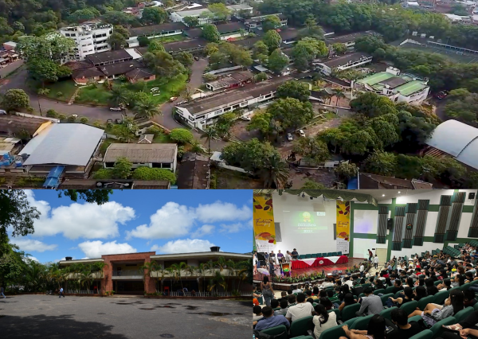
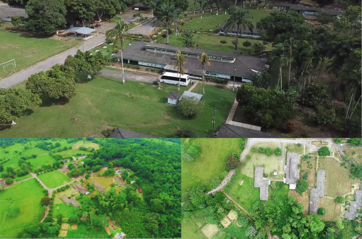
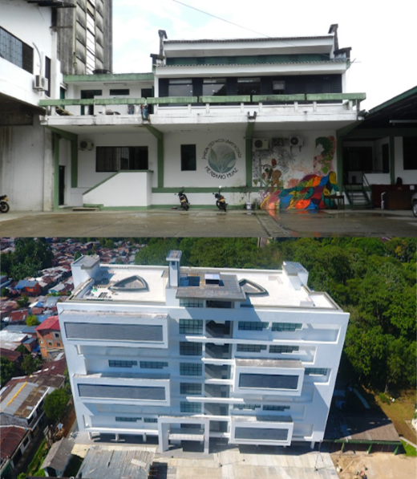
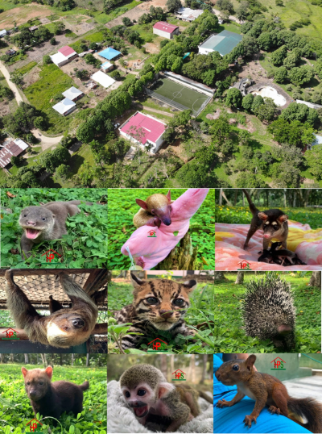
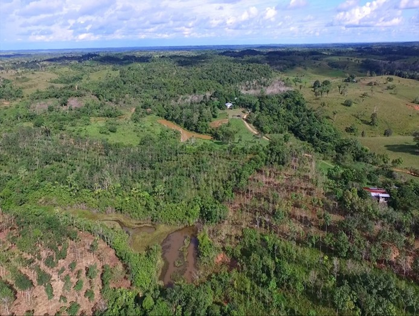

:::{.column-page layout="[1,1]" style="float:left;"}

<a href="https://www.youtube.com/watch?v=d9K8lsCGvT4">
{style="width:73%;"}
</a>

### Campus Florencia - Porvenir

Cuenta con espacios multifuncionales, entre ellos el Auditorio Monseñor Ángel Cuniberti, con capacidad para 500 personas, escenario de congresos nacionales previos como el IV Congreso Colombiano de Restauración Ecológica y el X Congreso Colombiano de Botánica. Actualmente, el auditorio se encuentra en proceso de modernización y dotación tecnológica, garantizando condiciones óptimas para el desarrollo del evento. 

:::

***

:::{.column-page layout="[1,1]" style="float:left;"}

<a href="https://www.youtube.com/watch?v=Ay0zbp6hXjA&t=90s">
{style="width:73%;"}
</a>

### Centro de Investigaciones Amazónicas Macagual – César Augusto Estrada González

Ubicado en el kilómetro 20 vía Morelia, es el espacio destinado para la investigación en Ciencias Biológicas y Ciencias Agrícolas. Este centro de 371 hectáreas se encuentra rodeado por un entorno natural que fomenta la investigación de campo, especialmente en temas de flora y fauna. Aquí se llevan a cabo estudios enfocados en la sostenibilidad, la conservación y el manejo ambiental de los agroecosistemas y sistemas productivos de la región. [Ver ubicación.](https://maps.app.goo.gl/Kj4hgGezeJTok7weA){target="_blank"}

:::

***

:::{.column-page layout="[1,1]" style="float:right;"}

<>
{style="width:73%;"}
</a>

### Campus Florencia – Juan XXIII

Este espacio ocupa un área de 6,2 hectáreas en el corazón de Florencia. Aquí se encuentran el nuevo edificio Yapurá (este vocablo que deriva del tupí iupará es utilizado en la Amazonia para referirse a un barrio de Florencia, al río Caquetá, al árbol de batí (Erisma japura) y el alimento que deriva de sus semillas, y a la especie Potos flavus), el Museo de Historia Natural-UAM, el Jardín Botánico y el Herbario HUAZ, que cuentan con diversas colecciones biológicas.  

:::

***

:::{.column-page layout="[1,1]" style="float:left;"}

<> 
{style="width:73%;"}
</a>

### Centro Experimental Santo Domingo

Ubicado en el km 6 vía Morelia, en él se enfocan esfuerzos y recursos para afrontar las necesidades del sector agropecuario y agroindustrial.  El Centro Experimental cuenta con 10 unidades de apoyo académicas, entre ellas, el Hogar de Paso en Fauna Silvestre (HPFS), el Laboratorio de Anatomía Animal, las Clínicas de Pequeños y Grandes Animales, cinco Plantas Agroindustriales y áreas de producción avícola y piscícola.  

:::

***

:::{.column-page layout="[1,1]" style="float:left;"}

<>
{style="width:73%;"}
</a>

### Centro Experimental Agroecológico Balcanes

El centro experimental se encuentra ubicado a 30 km del casco urbano de Florencia, en el corregimiento de Venecia, vereda Balcanes, y tiene un área de 68 hectáreas. En él se enfocan esfuerzos para afrontar las necesidades y los cambios que enfrentan los agroecosistemas y ecosistemas naturales de la Amazonía, aportando conocimiento para la conservación, el uso sostenible de la biodiversidad y los servicios ecosistémicos.  

:::

